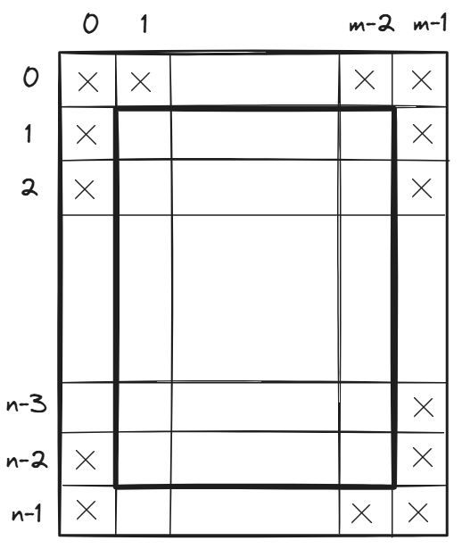
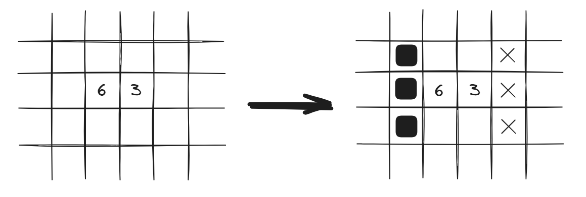
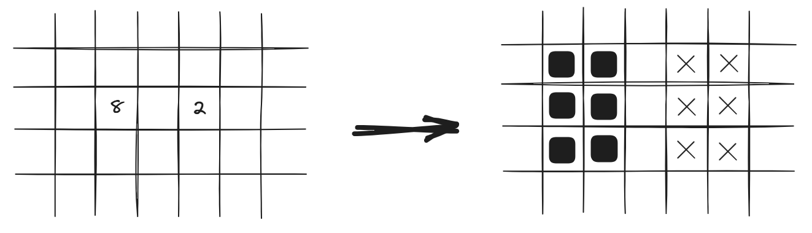
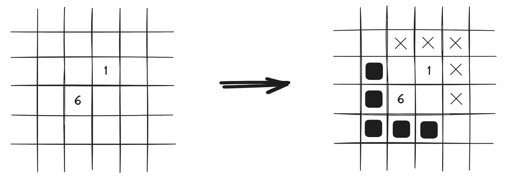
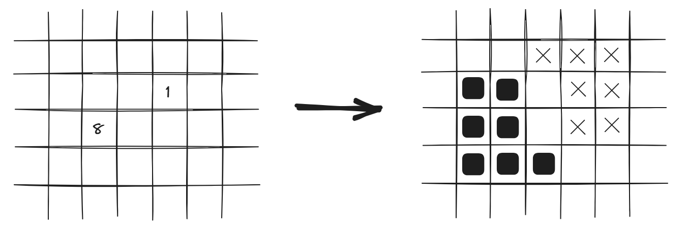

# Документация

Описание решения японской мозаики

## Модель данных

Японская мозайка задаётся матрицей размера n на m, в некоторых клетках которой записаны числа от 0 до 9, задающие число закрашенных клеток среди клеток вокруг клетки с цифрой и самой клетки с цифрой.

Решением является также матрица размера n на m с закрашенными клетками.

Таким образом матрица задания состоит из пустых либо заполненых числами 0-9 клеток. Для удобства работы заполним пустые клетки числом -5.

Матрица решения изначально состоит из пустых клеток. Для удобства решения будем не только закращивать клетки, но и отмечать те, которые закрашенными быть не могут. Таким образом клетки в решении могут быть заполены:

- 0, если клетка пустая;
- 1, если клетка закрашенна;
- 10, если клетка не может быть закрашена (для удобства далее будем говорить, что это клетка с крестиком).

Для удобства работы с границами вокруг обеих матриц сделана граница, состоящая из пустых клеток для задания и и клеток с крестиками для решения. Итоговый размер матриц состовляет n+2 на m+2 клеток.

## Алгоритм решения

### 1. Первичная обработка

1. Обработка всех 0 и 9

2. Обработка различных ситуаций

    - 1 - находящиеся рядом числа = n и n-3
    

    - 2 - находящиеся через ряд числа = n и n-6
    

    - 3 - находящиеся по диагонали числа = n и n-5
    

    - 4 - ситуация с 8 и 1
    

### 2. Основной алгоритм

1. Обработка тривиальных ситуаций

    - число свободных клеток = числу клеток, которые необходимо закрасить
    - число закрашенных клеток = числу клеток, которые необходимо закрасить
